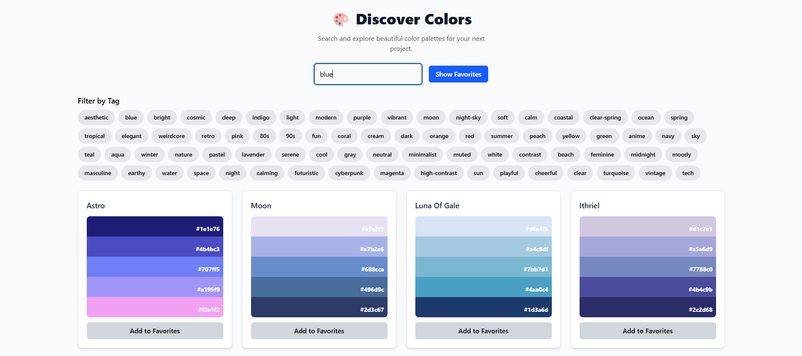
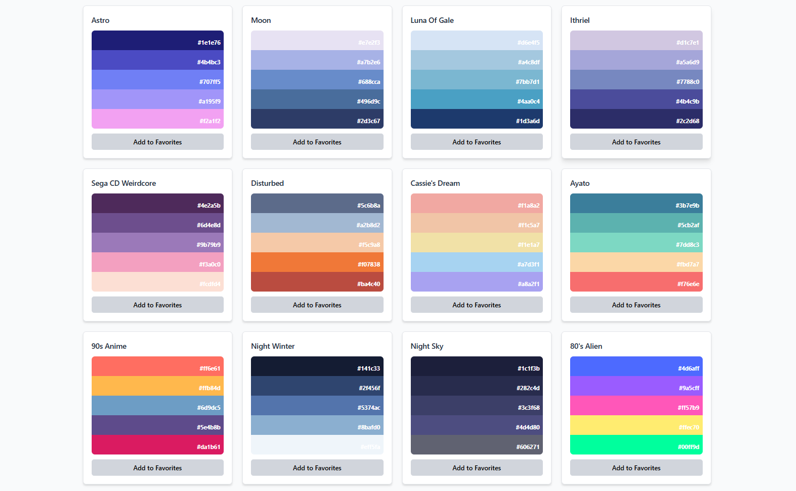

# 🎨 Color Palette Explorer

Color Palette Explorer is a React-based web app that allows users to search, explore, and save their favorite color palettes. The app fetches color palettes from an external API and provides various filtering options, including tags and a favorites section stored in local storage.


## 📦 Installation

1. Clone the repository:
   ```sh
   git clone https://github.com/your-username/color-palette-explorer.git
   cd color-palette-explorer
2. Install dependencies:
    ```sh
    npm install
3. Start the development server:
    ```sh
    npm run dev

## 🚀 Features

- 🔍 **Search for Color Palettes**: Enter a keyword to discover palettes.
- 📌 **Filter by Tags**: Easily refine your search using tags.
- ❤️ **Add to Favorites**: Save your favorite palettes locally.
- 📋 **Copy Colors**: Click on a color to copy its hex code.
- 📱 **Responsive UI**: Dropdown for filtering on small screens.
- 🖥️ **Local Storage Support**: Persist favorite palettes across sessions.

## 🛠️ Usage

- Open the app in your browser (http://localhost:3000).
- Use the search bar to find color palettes.
- Click on a color to copy its hex code.
- Use the tag filter or dropdown (on smaller screens) to refine results.
- Click "Add to Favorites" to save a palette.
- Toggle "Show Favorites" to view your saved palettes.

## 📸 Screenshots



## 🏗️ Technologies Used

- React.js

- Tailwind CSS

- Axios (for API requests)

- Local Storage (for favorites persistence)